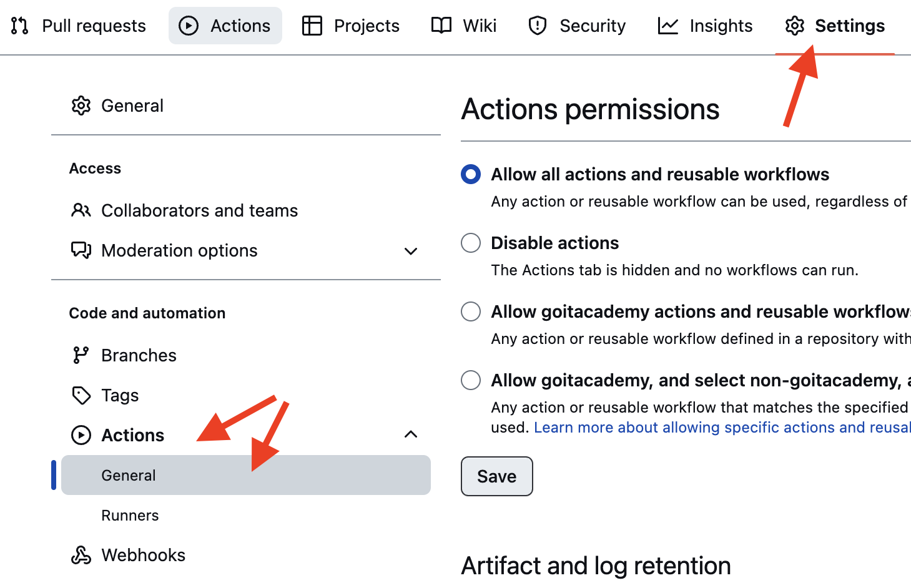

<!-- Headerul este format din trei componente atunci cand utilizatorul este autentificat si anume: logo, userinfo si navigation pentru utilizator autentificat (navigation pentru utilizator autentificat care face trimitere la 'DiaryPage' si 'CalculatorPage'). In versiunea de desktop 'burger menu' este inlocuit de navigation pentru utilizator autentificat si anume 'Diary' si 'Calculator' si va aparea in partea dreapta a logoului, userinfo va aparea in partea dreapta a headerului. In versiunea pentru  tableta logoul este in stanga headerului iar in partea dreapta este userinfo si in dreapta userinfo este burgermenu. In versiunea pentru mobile logo in partea stanga iar in partea dreapta apare burger menu si jos sub burger menu apare 'user info'. User info pentru mobile apare pe toate latimea paginii. Atunci cand utilizatorul nu este autentificat apare componenta 'navigation' Acesta este codul '// header.js
import React from 'react';
import Navigation from '../navigation/navigation.js';
import styles from './header.module.css';
import BurgerMenu from './../burgerMenu/burgerMenu.js';
import UserInfo from './../userInfo/userInfo.js';
import Logo from './../logo/logo.js';

const Header = ({ isAuthenticated, userName, onLogout }) => {
  return (
    <header className={styles.header}>
      {isAuthenticated ? (
        <>
          <div className={styles.topContainer}>
            <Logo />
            <BurgerMenu className={styles.burger} />
          </div>
          <div className={styles.bottomContainer}>
            <UserInfo userName={userName} onLogout={onLogout} />
          </div>
        </>
      ) : (
        <Navigation
          isAuthenticated={isAuthenticated}
          userName={userName}
          onLogout={onLogout}
        />
      )}
    </header>
  );
};

export default Header;' ; '/* header.module.css */

.header {
  display: flex;
  flex-direction: column;
  justify-content: space-between;
  background-color: #f8f9fa;
  padding: 16px;
}

.topContainer {
  display: flex;
  justify-content: space-between;
  align-items: center;
}

.bottomContainer {
  display: flex;
  justify-content: flex-end;
  margin-top: 16px;
  background: #eff1f3;
  width: 100%;
  height: 100%;
}

.logoContainer {
  cursor: pointer;
}

.navigationContainer {
  flex: 1;
  display: flex;
  justify-content: center;
}

.userInfoContainer {
  display: flex;
  align-items: center;
  margin-right: 24px;
}

@media (min-width: 768px) {
  .header {
    flex-direction: row;
    padding: 24px;
  }

  .bottomContainer {
    margin-top: 0;
    justify-content: flex-end;
    background-color: transparent;
  }

  .userInfoContainer {
    display: flex;
    align-items: center;
    margin-right: 24px; /* Distanța între UserInfo și BurgerMenu */
  }
}

@media (min-width: 1024px) {
  .header {
    padding: 32px;
  }

  .burger {
    display: none;
  }

  .bottomContainer {
    margin-top: 0;
    justify-content: flex-end;
    background-color: transparent;
  }
}' ; 'import React from 'react';
import styles from './logo.module.css';

const Logo = () => <div className={styles.logo} aria-label="Logo"></div>;

export default Logo;' ; 'import React, { useState } from 'react';
import axios from 'axios'; // Importăm Axios pentru a face cererea HTTP
import styles from './userInfo.module.css';

const UserInfo = ({ userName, onLogout }) => {
  const [message, setMessage] = useState('');
  const [error, setError] = useState('');

  const handleLogout = async () => {
    try {
      const token = localStorage.getItem('token');
      const config = {
        headers: { Authorization: `Bearer ${token}` },
      };
      await axios.get('http://localhost:3001/api/users/logout', config);
      onLogout();
      setMessage('You have been logged out successfully.');
      setError('');
    } catch (error) {
      console.error('Error logging out:', error);
      setMessage('');
      setError('Logout failed. Please try again.');
    }
  };

  return (
    <div className={styles.userInfo}>
      {message && <p className={styles.successMessage}>{message}</p>}
      {error && <p className={styles.errorMessage}>{error}</p>}
      <span className={styles.userName}>{userName}</span>
      <span className={styles.vector}></span>
      <button className={styles.exitButton} onClick={handleLogout}>
        Exit
      </button>
    </div>
  );
};

export default UserInfo;' ; '.userInfo {
  display: flex;
  align-items: center;
  justify-content: center;
  padding: 1rem;
}

.userName {
  margin-right: 8px;
  font-weight: bold;
  color: #9b9faa;
  border-radius: 4px;
  font-family: var(--font-family);
  font-weight: 700;
  font-size: 14px;
  letter-spacing: 0.04em;
}

.successMessage {
  color: green;
}

.errorMessage {
  color: red;
}

.exitButton {
  cursor: pointer;
  padding: 8px 16px;
  border: none;
  background-color: transparent;
  color: #9b9faa;
  border-radius: 4px;
  font-family: var(--font-family);
  font-weight: 700;
  font-size: 14px;
  letter-spacing: 0.04em;
}

.vector {
  background-image: url(./../../../public/images/Vector1.png);
  margin-right: 8px;
  color: black;
}

@media (min-width: 768px) {
  .userInfo {
    justify-content: flex-end;
    margin-right: 24px;
  }

  .exitButton {
    padding: 10px 20px;
  }
}

@media (min-width: 1024px) {
  .userInfo {
    margin-right: 32px;
  }

  .exitButton {
    padding: 12px 24px;
  }
}' ; '// BurgerMenu.jsx
import React from 'react';
import { useEffect, useState } from 'react';
import { useNavigate } from 'react-router-dom';
import styles from './burgerMenu.module.css';
import { useLocation } from '../../../node_modules/react-router-dom/dist/index';

const BurgerMenu = () => {
  const [isOpen, setIsOpen] = useState(false);
  const navigate = useNavigate();
  const [activeMenu, setActiveMenu] = useState('');
  const location = useLocation();

  useEffect(() => {
    if (location.pathname === '/user/diary') {
      setActiveMenu('diary');
    } else if (location.pathname === '/user/calculator') {
      setActiveMenu('calculator');
    } else {
      setActiveMenu('');
    }
  }, [location.pathname]);

  const toggleMenu = () => {
    setIsOpen(!isOpen);
  };

  const goToDiary = () => {
    navigate('/user/diary');
    setIsOpen(false);
  };

  const goToCalculator = () => {
    navigate('/user/calculator');
    setIsOpen(false);
  };

  return (
    <div className={styles.burgerMenu}>
      {isOpen ? (
        <button onClick={toggleMenu} className={styles.closeButton}>
          &times;
        </button>
      ) : (
        <div className={styles.burger} onClick={toggleMenu}>
          &#9776;
        </div>
      )}
      {isOpen && (
        <div className={styles.modal}>
          <div className={styles.overlay} onClick={toggleMenu}></div>
          <div className={styles.menu}>
            <div
              onClick={goToDiary}
              className={`${styles.menuItem} ${
                activeMenu === 'diary' ? styles.active : ''
              }`}
            >
              Diary
            </div>
            <div
              onClick={goToCalculator}
              className={`${styles.menuItem} ${
                activeMenu === 'calculator' ? styles.active : ''
              }`}
            >
              Calculator
            </div>
          </div>
        </div>
      )}
    </div>
  );
};

export default BurgerMenu;' ; '.burger {
  font-size: 24px;
  cursor: pointer;
  position: fixed;
  top: 15px;
  right: 15px;
  z-index: 1000;
}

.closeButton {
  font-size: 24px;
  cursor: pointer;
  position: fixed;
  top: 15px;
  right: 15px;
  background: none;
  border: none;
  color: #000;
  z-index: 1000;
}

.modal {
  position: fixed;
  top: 90px;
  right: 0;
  width: 100%;
  height: 93%;
  background-color: #264061;
  box-shadow: -2px 0 5px rgba(0, 0, 0, 0.5);
  z-index: 999;
}

.overlay {
  position: fixed;
  top: 0;
  left: 0;
  width: 100%;
  height: 100%;
  background-color: transparent;
  z-index: 998;
}

.menu {
  display: flex;
  flex-direction: column;
  padding: 20px;
  align-items: center;
}

.menuItem {
  margin: 15px 0;
  cursor: pointer;
  font-size: 18px;
  color: #fff;
  font-family: var(--font-family);
  font-weight: 700;
  font-size: 18px;
  letter-spacing: 0.04em;
  text-transform: uppercase;
  text-align: center;
  color: #fff;
}

.menuItem:hover {
  color: #9b9faa;
  cursor: pointer;
}

.menuItem.active {
  color: #9b9faa;
  cursor: pointer;
}

/* Ascunde BurgerMenu pe desktop */
@media (min-width: 769px) {
  .burger {
    display: none;
  }

  .modal {
    width: 70%;
  }
}

@media (min-width: 1028px) {
  .burger {
    display: none;
  }

  .modal {
    display: none;
  }
}' -->

# React homework template

"build": "cross-env NODE_ENV=production webpack --config webpack.config.js",

Цей проект був створений за допомогою
[Create React App](https://github.com/facebook/create-react-app). Для знайомства
і налаштування додаткових можливостей
[звернися до документації](https://facebook.github.io/create-react-app/docs/getting-started).

## Створення репозиторію за шаблоном

Використовуй цей репозиторій організації GoIT як шаблон для створення
репозиторію свого проєкта. Для цього натисни на кнопку `«Use this template»` і
вибери опцію `«Create a new repository»`, як показано на зображенні.


На наступному кроці відкриється сторінка створення нового репозиторію. Заповни
поле його імені, переконайся що репозиторій публічний, після чого натисни кнопку
`«Create repository from template»`.


Після того як репозиторій буде створено, необхідно перейти в налаштування
створеного репозиторію на вкладку `Settings` > `Actions` > `General` як показано
на зображенні.



Проскроливши сторінку до самого кінця, у секції `«Workflow permissions»` вибери
опцію `«Read and write permissions»` і постав галочку в чекбоксі. Це необхідно
для автоматизації процесу деплою проєкту.


Тепер у тебе є особистий репозиторій проекту, зі структурою файлів і папок
репозиторію-шаблону. Далі працюй із ним як із будь-яким іншим особистим
репозиторієм, клонуй його собі на комп'ютер, пиши код, роби комміти і відправляй
їх на GitHub.

## Підготовка до роботи

1. Переконайся що на комп'ютері встановлено LTS-версія Node.js.
   [Завантаж і встанови](https://nodejs.org/en/) її якщо необхідно.
2. Встанови базові залежності проєкту командою `npm install`.
3. Запусти режим розробки, виконавши команду `npm start`.
4. Перейди в браузері за адресою [http://localhost:3000](http://localhost:3000).
   Ця сторінка буде автоматично перезавантажуватися після збереження змін у
   файлах проєкту.

## Деплой

Продакшн версія проєкту буде автоматично проходити лінтинг, збиратися і
деплоїтися на GitHub Pages, у гілку `gh-pages`, щоразу, коли оновлюється гілка
`main`. Наприклад, після прямого пушу або прийнятого пул-реквесту. Для цього
необхідно у файлі `package.json` відредагувати поле `homepage`, замінивши
`your_username` і `your_repo_name` на свої, і відправити зміни на GitHub.

```json
"homepage": "https://your_username.github.io/your_repo_name/"
```

Далі необхідно зайти в налаштування GitHub-репозиторію (`Settings` > `Pages`) і
виставити роздачу продакшн-версії файлів із папки `/root` гілки `gh-pages`, якщо
це не було зроблено автоматично.


### Статус деплоя

Статус деплою крайнього коміту відображається іконкою біля його ідентифікатора.

- **Жовтий колір** - виконується збірка і деплой проєкту.
- **Зелений колір** - деплой завершився успішно.
- **Червоний колір** - під час лінтингу, сборки або деплою сталася помилка.

Детальнішу інформацію про статус можна подивитися, клікнувши на іконку, і у
вікні, що випадає, перейти за посиланням `Details`.


### Жива сторінка

Через якийсь час, зазвичай кілька хвилин, живу сторінку можна буде подивитися за
адресою, вказаною у відредагованій властивості `homepage`. Наприклад, ось
посилання на живу версію для цього репозиторію
[https://goitacademy.github.io/react-homework-template](https://goitacademy.github.io/react-homework-template).

Якщо відкривається порожня сторінка, переконайся, що у вкладці `Console` немає
помилок пов'язаних із неправильними шляхами до CSS і JS файлів проєкту
(**404**). Швидше за все у тебе неправильне значення властивості `homepage` у
файлі `package.json`.

### Маршрутизація

Якщо додаток використовує бібліотеку `react-router-dom` для маршрутизації,
необхідно додатково налаштувати компонент `<BrowserRouter>`, передавши у пропе
`basename` точну назву твого репозиторію. Слеш на початку рядка обов'язковий.

```jsx
<BrowserRouter basename="/your_repo_name">
  <App />
</BrowserRouter>
```

## Як це працює


1. Після кожного пушу в гілку `main` GitHub-репозиторія, запускається
   спеціальний скрипт (GitHub Action) з файла `.github/workflows/deploy.yml`.
2. Усі файли репозиторію копіюються на сервер, де проект ініціалізується і
   проходить лінтинг і збірку перед деплоєм.
3. Якщо всі кроки пройшли успішно, зібрана продакшн-версія файлів проєкту
   відправляється в гілку `gh-pages`. В іншому випадку, в лозі виконання скрипта
   буде вказано в чому проблема.
